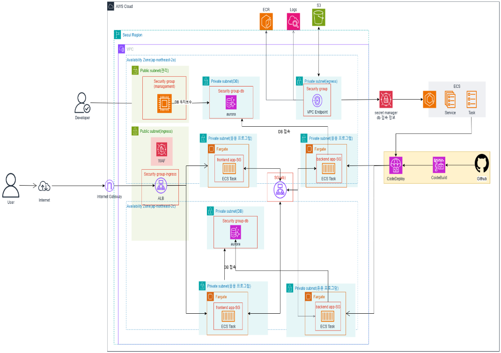
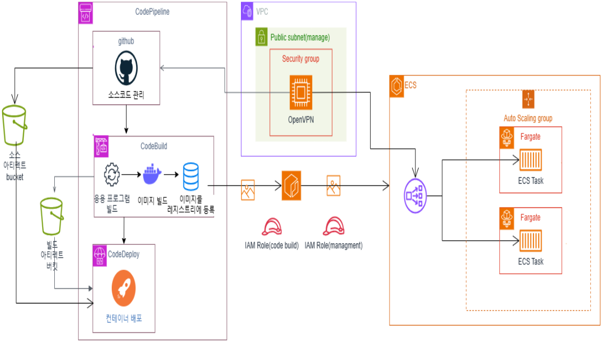

# MUGU - 무엇이든 구해보세요 

**집에 필요 없는 물건을 쉽게 팔거나, 단기적인 알바를 구하기 위한 사이트**
- 회원 가입 및 로그인 기능 제공.
- 회원 각각의 장바구니 기능 및, 검색 기능 제공.
- 업로드 후 업로드한 사람과의 채팅 구현.
- 원하는 만큼의 캐시를 입력하고, 충전 할수있는 기능.
- 클라우드 기반으로 서비스의 자동 배포 및 확장성을 지원

---

# 클라우드 아키텍처

## 구조 설명
- Fargate, ECS로 프런트엔드·백엔드 컨테이너 배포, 블루/그린 배포, Aurora 사용.
- Github, CodeBuild, CodeDeploy를 통해 자동화된 ECS 배포 진행.
- ECR에 컨테이너 이미지 저장, CloudWatch Logs, Fluent Bit로 로깅 및 모니터링 수행.
- WAF, Security Group, VPC Endpoint를 활용한 보안.

---

# CI/CD 파이프라인

-  GitHub에서 코드를 푸시하면 CodePipeline이 이를 감지하고, CodeBuild가 Docker 이미지를 빌드하여 컨테이너 레지스트리에 저장 
-  이후 CodeDeploy가 이를 ECS의 Fargate 환경에 배포하며, Auto Scaling Group을 통해 컨테이너를 동적으로 확장/축소
-  IAM 역할을 활용하여 권한을 관리. Blue/Green 배포 및 모니터링.

